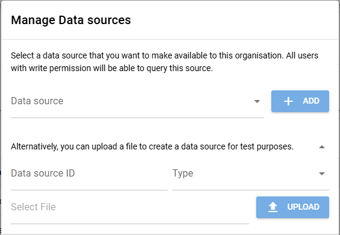

# Administration
{: .no_toc }

## Table of contents
{: .no_toc .text-delta }

1. TOC
{:toc}

## Overview

The TOP Framework consists of:

* **Frontend:** [Vue.js](https://vuejs.org) and [Quasar](https://quasar.dev) based Single-Page Application ([top-frontend](https://github.com/Onto-Med/top-frontend))
* **Backend:** [Spring Boot Resource Server](https://docs.spring.io/spring-security/reference/servlet/oauth2/resource-server/index.html) ([top-backend](https://github.com/Onto-Med/top-backend))

## Getting started
Follow these instructions to set up the TOP framework:

1. Clone this repository

        git clone https://github.com/Onto-Med/top-deployment.git
        cd top-deployment
2. Copy [docker-compose.env.tpl](https://github.com/Onto-Med/top-deployment/blob/main/docker-compose.env.tpl) and modify it as needed

        cp docker-compose.env.tpl docker-compose.env
3. Use Docker Compose to startup the TOP Framework services

        docker compose up -d

If you didn't modify docker-compose.env, you can now access the framework at <http://localhost> in your browser.

All data will be stored in the Docker volume `top-data` (see declaration at the end of [docker-compose.yml](https://github.com/Onto-Med/top-deployment/blob/main/docker-compose.yml)).
Feel free to update this volume configuration (e.g., make it external or provide an absolute path on the host).

### How to Upgrade

1. Backup your Docker volumes
2. Pull changes from this repository

        cd top-deployment
        git pull
3. Review [docker-compose.env.tpl](https://github.com/Onto-Med/top-deployment/blob/main/docker-compose.env.tpl) for new environment variables
4. Pull Docker images and recreate containers

        docker compose up --pull always -d

### Use SSL
The TOP Framework uses [Caddy](https://caddyserver.com) as reverse proxy. Caddy is able to automatically generate SSL certs for you.

Do the following to enable SSL:

1. Add a port mapping for port 443 to docker compose service 'caddy'

        services:
          caddy:
            # ...
            ports:
              - 80:80
              - 443:443
2. Modify the environment variable `BASE_URL` in `docker-compose.env` to something like: 'https://your.domain'
3. Restart the docker compose stack

        docker compose up -d

### Add Plugins
Plugins can be provided as JAR files (dependencies must be included too, see for example [Apache Maven Assembly Plugin](https://maven.apache.org/plugins/maven-assembly-plugin/usage.html)).
You just have to place those JAR files in a directory and mount it to `\plugins` directory of the backend container.

```yml
services:
  backend:
    # ...
    volumes:
      - top-plugins-dir:/plugins
  volumes:
    top-plugins-dir:
      # volume settings
```

More information about backend plugins is available at the [top-backend documentation](https://github.com/Onto-Med/top-backend#plugins).

### Add Data Adapter Configurations
You can create data adapter configuration files and mount them into the `backend` container by modifying [docker-compose.yml](https://github.com/Onto-Med/top-deployment/blob/main/docker-compose.yml).
In this example, we assume that the data source configurations reside in the `./configs` folder.
To make a data source available to an organization and all of its repositories, an administrator has to add the data source in the organization page via the "Manage"->"Data sources" menu.
For a detailed specification of the configuration files, see [Data Adapter Configuration](./administration/data-adapter-configuration).

```yml
services:
  backend:
    # ...
    volumes:
      - ./configs:/configs:ro
```

There is also an option to upload specific formats to create a data source that is directly stored in the backend database. The form to upload data sources is also located in the organization menu "Manage"->"Data sources". We currently support the upload of FHIR and CSV files.After the upload has finished, you can enable the data source for any organization.



### NLP/Document related configuration
To utilize the document search of the framework, one needs three different services running: 

1. Elasticsearch or something similar
2. A Neo4j cluster
3. And the [concept graphs service](https://github.com/Onto-Med/concept-graphs)

The document search is adapter-centric and requires a working configuration file (YAML) that specifies the addresses of the above services
in the folder declared with the `DOCUMENT_DATA_SOURCE_CONFIG_DIR` environment variable.
If no `DOCUMENT_DEFAULT_ADAPTER` is specified, the first adapter found in the folder is used for setup.

Similarly to data adapter configurations, document adapter configurations must be mounted into the backend Docker container.

For convenience reasons, the default value of `DOCUMENT_DATA_SOURCE_CONFIG_DIR` is `/configs/nlp`, which means that you can create a sub folder `nlp` in the host systems `configs` folder and reuse the Docker mount configuration from [NLP/Document related configuration](#add-data-adapter-configurations).

### Protection with OAuth2
If you want to protect front and backend with OAuth2 authentication, you must set up a [Keycloak](https://quay.io/repository/keycloak/keycloak?tab=info) server.
Respective Keycloak containers are already included in the [docker-compose.yml](https://github.com/Onto-Med/top-deployment/blob/main/docker-compose.yml) file (use docker compose profile "auth", e.g.: `docker compose --profile auth up -d`).

You may also need to modify the configurations in `docker-compose.env.tpl`.

If Keycloak is run for the first time, you need to create an admin account:

```sh
docker compose exec keycloak /opt/jboss/keycloak/bin/add-user-keycloak.sh -u <USERNAME> -p <PASSWORD>
docker compose restart keycloak
```

After starting Keycloak, log in with admin credentials and perform the following tasks:
1. Create a new realm (e.g.: "top-realm")
2. Create a new client for that realm (e.g.: "top-frontend"). Make sure to modify the URLs in the client configuration to match your TOP Frontend instance.

The TOP Frontend should now display a login button in the top right corner. If a visitor clicks on that button they will be redirected to the Keycloak login page.
After a successful login they will be redirected back to the TOP Frontend.

## Troubleshoot

* **`java.lang.OutOfMemoryError` when running queries:**

  Depending on the query complexity and the amount of data available in a data source, queries may require a lot of memory (RAM).
  You can increase the Java Runtime Environment's maximum Java heap size with the [-Xmx option](https://docs.oracle.com/cd/E13150_01/jrockit_jvm/jrockit/jrdocs/refman/optionX.html#wp999528).

  Override the `entrypoint` of the `backend` service in the [docker-compose.yml](https://github.com/Onto-Med/top-deployment/blob/main/docker-compose.yml) file:

      services:
        backend:
          # set maximum heap size to 4GB
          entrypoint: java -Xmx4G -cp top-backend.jar:/plugins/* org.springframework.boot.loader.PropertiesLauncher
          # other options...
