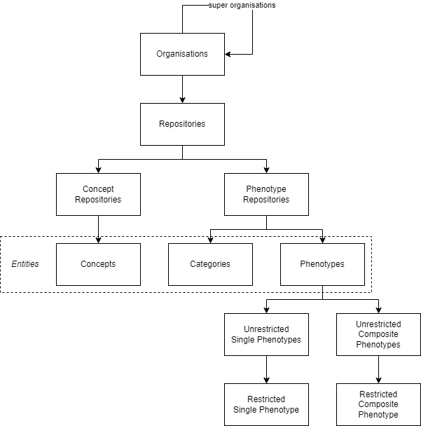

# Content Types
{: .no_toc }
{: .fs-6 .fw-300 }
This page contains detailed information about all content types, storable in the TOP Framework.

## Table of contents
{: .no_toc .text-delta }

1. TOC
{:toc}


_Figure 1: Hierarchy of the TOP Framework content types._

## Organisations

Organisations can be used to store research groups, institutions or (scientific) projects. They can further be structured by specifying super organisations.

## Repositories

Repositories are one of the main components of the TOP Framework. They hold all all types of entities.

We recommend you to create a repository for each [phenotype algorithm](#phenotype-algorithm) you want to model.
By capsulising algorithms that way, you make sure that they are more comprehensible and can be find easily.

## Entities

The term 'entity' is a generic term to express all content types listed below.

These content types have in common that they can be referenced by URLs (deep links) and they are versioned.
You can always switch between versions and restore previous once.
More details about versioning are described [here](phenotype-editor/versioning).

Additionally, entities have the following properties in common:

* unique identifier
* multilingual titles, there can only be one title per language
* multilingual synonyms
* multilingual descriptions/definitions
* codes of standard terminologies, like [LOINC](https://loinc.org), [SNOMED CT](https://www.snomed.org), etc.

You can find more information about the different entity types and the underlying ontological model in our publication:

> Uciteli A, Beger C, Kirsten T, Meineke FA, Herre H. Ontological representation, classification and data-driven computing of phenotypes. J Biomed Semantics. 2020 Dec 21;11(1):15. doi: [10.1186/s13326-020-00230-0](https://doi.org/10.1186/s13326-020-00230-0).

### Categories

Use categories to structure repositories. They are similar to folders in a file system and serve no other purpose than organising content.

### Phenotypes

Phenotypes are another one of the main components of the TOP Framework. We use the following definition for the term 'phenotype':

> A (combination of) bodily feature(s) of an organism determined by the interaction of its genetic make-up and environment.
>
> <small>_Scheuermann RH, Ceusters W, Smith B. Toward an ontological treatment of disease and diagnosis. Summit Transl Bioinform. 2009 Mar 1;2009:116-20. PMID: [21347182](https://pubmed.ncbi.nlm.nih.gov/21347182/); PMCID: [PMC3041577](https://www.ncbi.nlm.nih.gov/pmc/articles/PMC3041577/)._</small>

The phenotypes you model in the TOP Framework are actually classes. The phenotypes of individuals (organisms, people, patients, ...) are members of these classes. For example, the height of the person John Doe is a member of the phenotype class 'Height' and has the value 180 centimetres.

All phenotypes have the mandatory property 'data type', which can be one of numeric, date time, text and Boolean.
Numeric phenotypes may also have a unit of measurement, specified as [Unified Code for Units of Measure (UCUM)](https://ucum.org).

We distinguish between single and composite phenotypes, which are described below.

#### Single Phenotypes

Basic properties of individuals are modelled as single phenotypes. They can also be called 'atomic' or 'elemental', because of their indivisible nature.
All single phenotypes should have at least one code associated with them, so that they can be mapped to individual data in any kind of data holding source system.

#### Composite Phenotypes

In contrast to single phenotypes, composite once are constructed from one or more single or composite phenotype or constant (arguments).
This is done by applying functions (e.g., addition, subtraction, logical 'and' operation, etc.) that transform a set of input arguments to typically one value.

**Example:**

The expression if the phenotype 'BMI' (body mass index) could look like:

```
Weight [kg] / (Height [cm] / 100) ^ 2
```

#### Difference Between Unrestricted and Restricted Phenotypes

Single and composite phenotypes can further be divided in unrestricted and restricted phenotypes. Unrestricted phenotypes represent all possible phenotypes of individuals,
whereas restricted phenotypes have further restrictions that must be matched in order for individual phenotypes to be classified to them.

**Example:**
All possible heights of individuals are classified to the unrestricted phenotype 'Height' and only a portion of them are classified to the restricted phenotype 'Height > 200 cm'.

## Phenotype Algorithm
