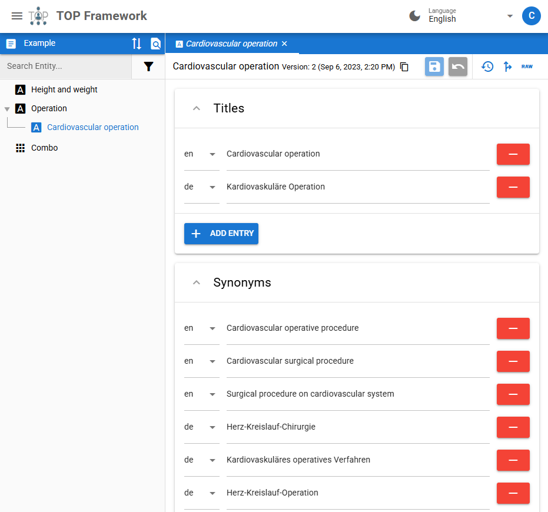
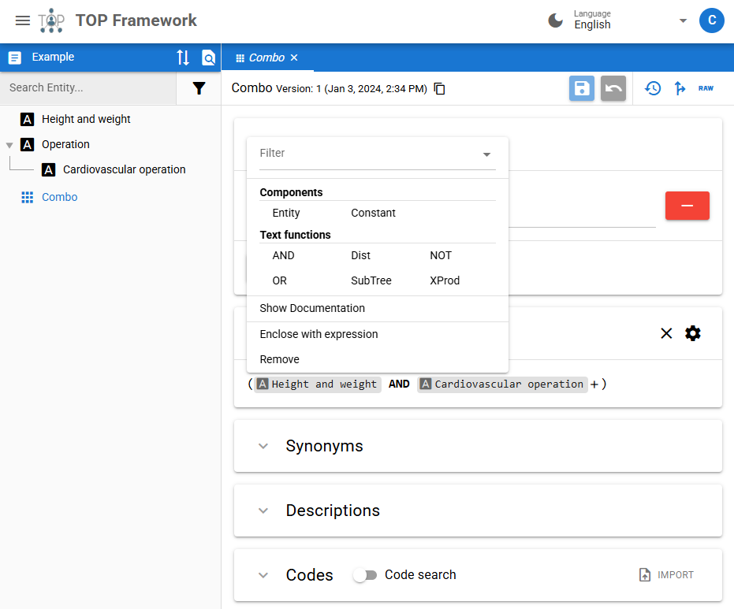
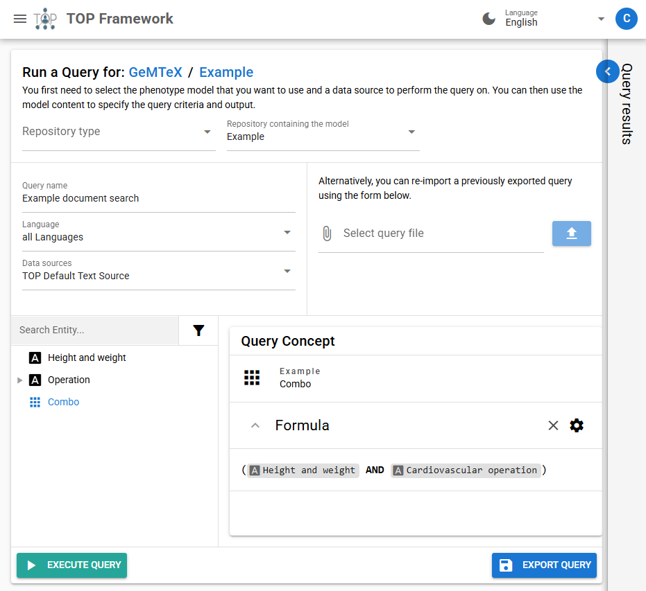
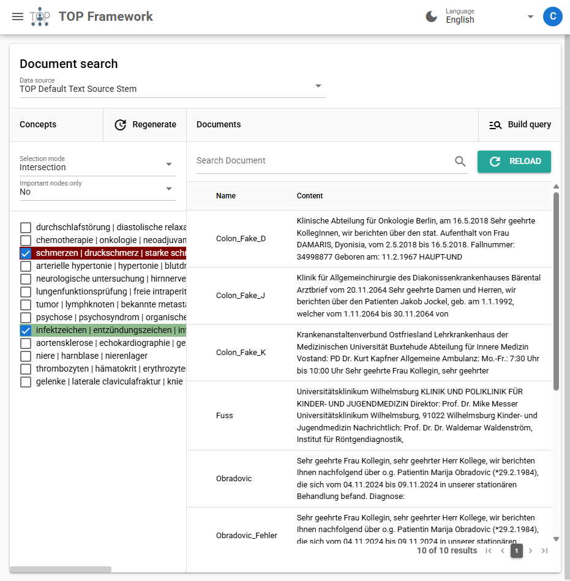

# Document Search

{: .no_toc }
{: .fs-6 .fw-300 }

This page describes how to search for documents in the TOP Framework.

## Background

The TOP Framework allows you to search for documents related to specific [concepts](./content-types#concepts), such as diseases, procedures, or medications.
This is useful for finding relevant medical reports, literature, guidelines, or other resources that can aid in clinical decision-making.

The TOP Framework supports searching documents using two distinct methods that are outlined in the following sections.

## Ontology-based Search

Search for documents based on concepts defined in an ontology (Search Ontology).
You can specify the concept you are interested in, and the framework will return documents that are associated with that concept.

To execute an ontology-based search, follow these steps:

1. Create a repository in the TOP Framework of the type "Concept repository".
   This repository will be used to store the ontology containing the concepts you want to search for.
2. Define necessary so called "single concepts" in the repository and provide synonyms for each of them.
   For this task you will use an interface that is similar to the [Phenotype Editor](./phenotype-editor) (see Figure 1).
3. In addition to the single concepts, you may also define composite concepts that are composed of multiple single or composite concepts.
   This allows you to create more complex search queries, using logical operators such as `AND`, `OR`, `NOT`, and even more advanced operators (see Figure 2).
4. Once the concepts are defined, you can use the search functionality to find documents that match the specified concepts.
   Open the Query builder by clicking on the respective button above the concept tree (see Figure 3).
5. Select a data source from the dropdown menu you want to search for documents in.
6. Select the concept you want to search for in the concept tree.
7. Click the "Execute query" button to start the search.
8. The result will be displayed in a table, showing the number of documents that match the selected concept.
   You can click on the table row to view the documents.

{: width="500" }

_Figure 1: Example of a single concept in a concept repository._

{: width="500" }

_Figure 2: Example of a composite concept definition with logical operators._

{: width="500" }

_Figure 3: Document search query builder interface._

## Concept Graph Search

Search for documents based on a pre-generated concept graph.
The concept graph is a structured representation of concepts and their relationships.
It is automatically generated using a machine learning model that processes the documents in an external document repository.
Within the graph, clusters of related concepts are identified, and you can search for documents within these clusters.

To execute a concept graph search, follow these steps:

1. Navigate to the document search interface in the TOP Framework (see Figure 4).
2. Select a data source from the dropdown menu that contains the documents you want to search.
3. A list of concept clusters will be displayed.
   Each cluster represents a group of related concepts.
4. Activate the checkbox next to the cluster you want to search in.
   It is also possible to select multiple clusters for a broader search.
   For this you need to change the selection mode from "Exclusive" to "Union" or "Intersection".

Search results will be displayed in a table next to the concept clusters.
You can click on the table row to view the content of a document.
There is also a text field to filter the results based on keywords or phrases.

{: width="500" }

_Figure 4: Concept graph search interface with clusters of related concepts._
