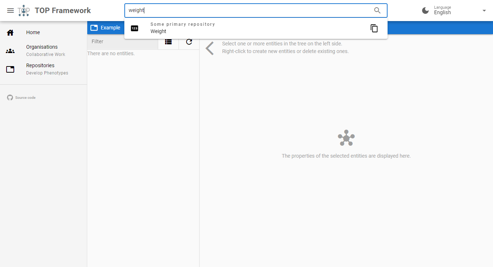
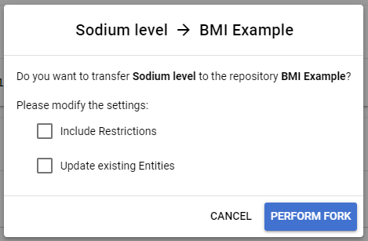
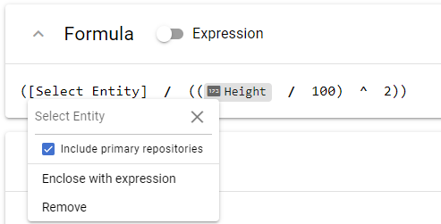

# Forking

Some repositories are marked as "primary". You can reuse entities contained in these repositories for your own repositories.
Here "reusing" means that a copy of an entity from a primary repository is created. In the background, the copy is linked to the originating entity.
We call the process of creating copies in your own repositories "forking". The copy is referred to as "fork" of the originating entity.

_Figure 1: Creating a fork of an entity from a primary repository._

You can create forks by searching for suitable entities in the search bar and by clicking on the copy button.
After you have created a fork, you can modify it as needed. The fork will have its own version history, but you can anytime sync it with the originating entity.

When you select an entity for forking, a menu will open as show in figure 2. In this menu you can configure the behaviours of the fork.

_Figure 2: The forking menu._

If you are editing a composite phenotype and want to add a phenotype from a different repository as argument of the expression, you can use the search context menu and tick "Include primary repositories" (see figure 3). The search result will then include phenotypes of primary repositories and if you select one of these phenotypes, the forking menu will open up.

_Figure 3: Creating a fork of an entity from a primary repository inside an expression._
