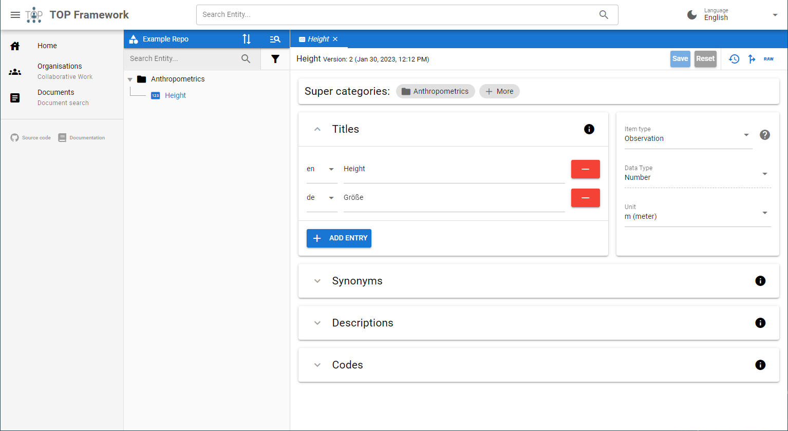
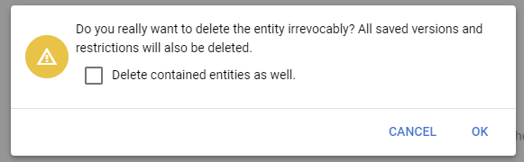
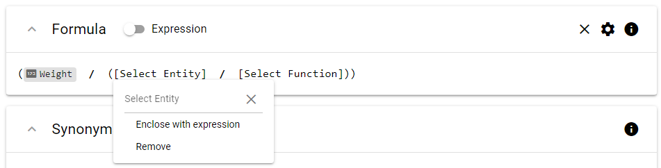
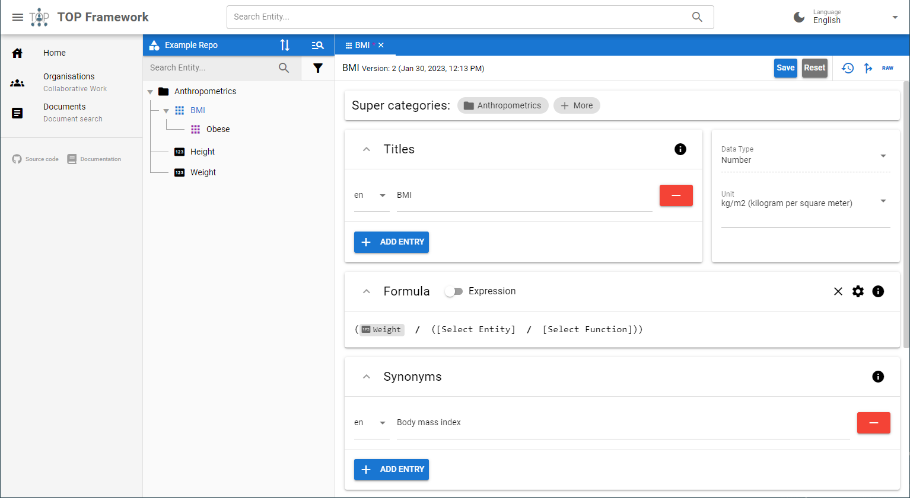
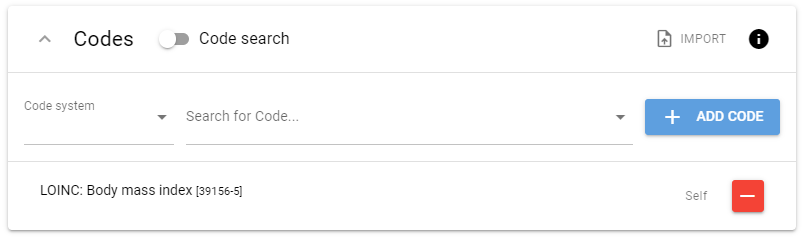

# Manipulate Entities
{: .no_toc }

## Table of Contents
{: .no_toc .text-delta }

1. TOC
{:toc}

## Create
In order to create new entities (phenotypes or categories) you have to navigate to a repository, where new entities shall be stored in.

On the left side of the screen you will see the tree view where all available entities of the repository are listed. If the repository is empty, the list is blank.

You can create new entities by right clicking anywhere in the tree. If you clicked on an empty space the new entity will be placed on root level. And if you clicked on a node, the new entity will be placed below this node.

A right click will always open a context menu with one ore more options, depending in the item you clicked on. In the example below a right click was performed on the category "Anthropometrics", thus the menu contains options to create abstract phenotypes, as well as to delete the category it self.

_Figure 1: Context menu to create a new entity._

After selecting one of the proposed options, a new tab will open on the right side of the editor. Fill out the fields and provide describing metadata where applicable. When you are satisfied, click on the "Save" button to persist the entered data.

## Update
To update existing entities, just left click on the desired entity in the tree on the left side. A tab with the selected entity will be displayed on the right side. You can now modify the field values and click on "Save" to submit the modifications.

_Figure 2: A single phenotype that can be modified and updated by clicking "Save"._

## Delete
As shown in figure 1, the context menu of entities in the tree on the left site contains an option to delete the selected entity. The context menu can be opened via right click. Depending on the type of the entity that will be deleted, additional entities will be affected by the delete operation.

If the entity is a category, you will be asked (see figure 3) whether all contained entities should be deleted too or "moved up" in the tree (i.e., the super category of C will become the super category of entities contained in C).

_Figure 3: Delete confirmation menu of a category._

If the entity is an abstract phenotype, all restrictions on that entity will be deleted too.

## Detailed Description of Editor Components

### Displaying Help Text for Form Components
You can always click on the info icons located at the top right of each component to display a short help text with further description
about that component

### Expression Editor
The Phenotype Editor has a special component to build boolean and mathematical expressions (see figure 4). You can left click parts of
an expression (i.e., entities, constants and functions) to open a small context menu. In this menu you can change the type of the part
and remove or surround it with another function. In case of entities, the context menu allows you to navigate to the definition of that
entity.

_Figure 4: Adding an entity to an expression._

Entities are added by selecting "Entity" as expression part. You can then enter the name or synonym of the desired entity.

_Figure 5: A composite phenotype where the mathematical formula was built with the expression editor component._

### Meaning of Icons
Throughout the application you will encounter different types of icons, each representing a specific entity type. If you have a look at figure 5, you will notice:

* the category "Anthropometrics" has a folder icon
* the unrestricted single phenotypes "Height" and "Weight" have a numeric icon that reflects the data type of these phenotypes
* the unrestricted composite phenotype "BMI" has an icon that consisting of several parts joined together, reflecting the composite nature of this phenotype (in this case the icon is coloured blue, because the phenotype is currently selected and it's metadata are shown in the tab on the right side)
* the restricted composite phenotype "Obese" has the same icon as "BMI" but is coloured in purple

### Code Input
At the end of each entity form, you will find a small component for specifying as many codes from standard terminologies as needed,
such as [SNOMED CT](https://snomed.org) or [LOINC](https://loinc.org). To add a new code, start typing into the 'Search for Code...' field. You will get suggestions derived from an Ontology Lookup Service. You can also select one code system in the field 'Code system' to filter the search result. When you have finished, simply click "Add code" or press ENTER to add a new entry to the list below. Entries in the list
can be deleted by clicking on the red minus button. Remember to save the whole form after you have made your changes.

Using the ENTER key is particularly useful as it allows you to add multiple codes very quickly.

In case the code system you want to search in is not provided by the Ontology Lookup Service, you can switch to manual code entry by clicking the 'Code search' switch. You then have to enter the URI of the code system and the code itself.

_Figure 6: Input component for codes from standard terminologies._
