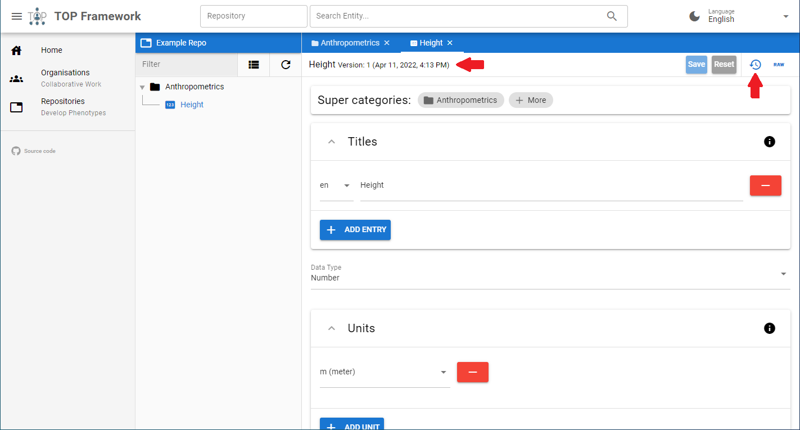
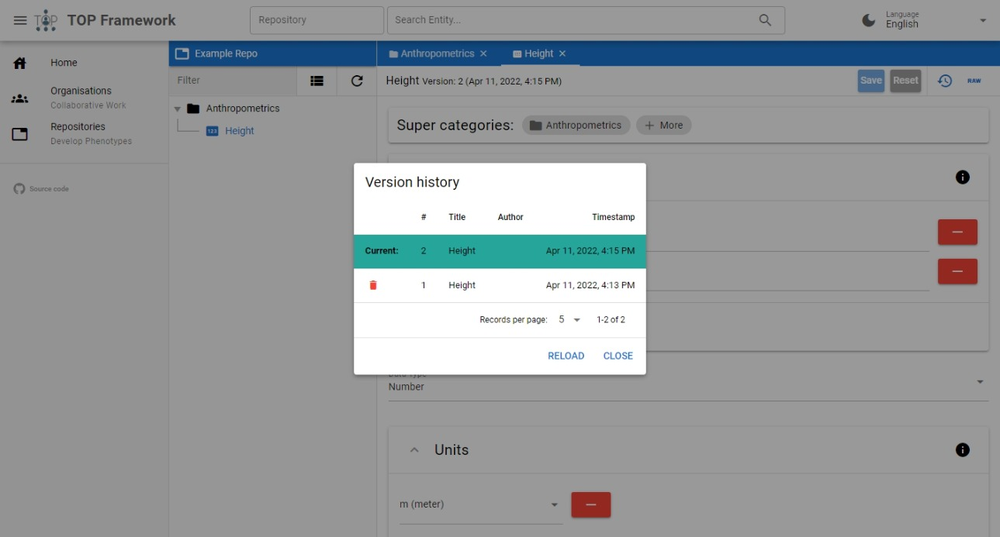

# Versioning
Whenever you are creating or changing an entity, a new version is created. You can see the current version of an entity on the top of the entities tab (see screenshot below).

By clicking on the clock on the top right side, all versions of the entity are displayed. You can jump to previous versions by left clicking on one of them.

You will enter a read-only mode of the selected version. In this mode you can examine the metadata of that version and restore it by clicking on "Restore".
