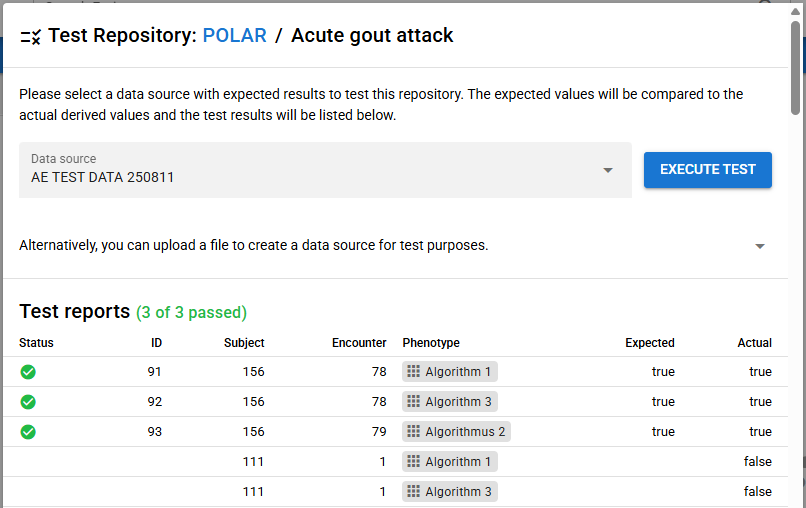

# Repository Testing
{: .no_toc }
{: .fs-6 .fw-300 }

This page describes how to test repositories in the TOP Framework.

## Background

The TOP Framework allows you to test repositories and all included phenotype definitions.
This is useful to ensure that phenotypes are defined correctly and that they yield the expected results when queried.

## Preparation

Before you can test a repository, ensure that you have the following:

- A repository with at least one phenotype definition.
- A test dataset that you can use to validate the phenotypes.

The test dataset should contain data that is representative of the data you expect to query against the phenotypes.

The dataset can be uploaded to the TOP Framework as a so called "local data source".
Similarly to other data sources, a local data source can be used to execute phenotype queries against it.

Test datasets are specified via [HL7 FHIR](https://hl7.org/fhir/) resource bundles or CSV files.
In case of CSV, you are required to specify files with the following content:

- **subjects:** A CSV file containing subject master data.

  Columns: `subjectId`, `birthDate`, `sex`
- **encounters:** A CSV file containing encounter data.

  Columns: `encounterId`, `subjectId`, `type`, `startDateTime`, `endDateTime`
- **subject resource data:** A CSV file containing subject resource data with either a reference to an encounter or a subject.
  This file can contain any resource type, such as observations, conditions, etc.
  Exactly one of the value columns must be filled, depending on the data type.

  Columns: `subjectResourceId`, `encounterId`, `subjectId`, `codeSystem`, `code`, `dateTime`,
  `startDateTime`, `endDateTime`, `unit`, `numberValue`, `textValue`, `booleanValue`,
  `dateTimeValue`
- **expected results:** A CSV file containing the expected results of the phenotype queries.

  Columns: `expectedResultId`, `subjectId`, `encounterId`, `phenotypeId`, `numberValue`,
  `textValue`, `booleanValue`, `dateTimeValue`

## Testing Process

To test a repository, follow these steps:

1. Navigate to the repository you want to test in the TOP Framework.
2. Click on the "Test Repository" button located above the entity tree, depicted as a checklist icon.
3. Select the test data source you want to use for testing.
   Alternatively, you can upload a new test dataset here, that was prepared as described above.
4. Click on the "Execute test" button to start the testing process.

The TOP Framework will execute the phenotype queries against the test dataset and compare the results with the expected results.
Once the test is complete, you will see a summary of the results, including any discrepancies between the expected and actual results.

The test results are displayed in a table format, showing the following columns:

- **Status:** Indicates whether the test passed or failed.
- **ID:** The unique identifier of the test case (equal to the `expectedResultId` column in the expected results CSV).
- **Subject:** The subject ID for which the test was executed.
- **Encounter:** The encounter ID associated with the test.
- **Phenotype:** The phenotype that was tested.
- **Expected:** The value that was expected for the phenotype.
- **Actual:** The value that was actually returned by the phenotype reasoner.

You will notice that the table may contain rows without a status. This indicates that the test data source contains data that is not referenced in the expected results.
